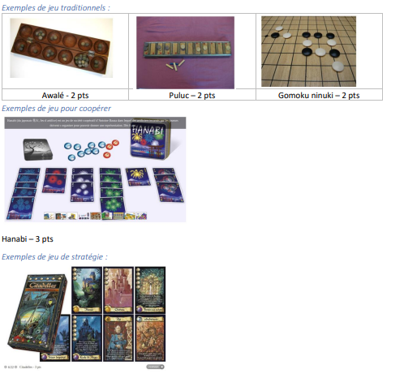
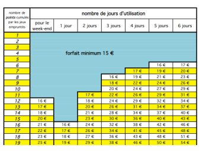

# maisonDuJeuWeb

- Développement d'un site web pour une association fictive pour pouvoir consultés des jeux de sociétés et espaces à reserver, les activités organisées, ect.

- Développée en PHP8

# Persitance des données en base de données

- Postgresql (utilisation de la bibliothèque de fonctions php-pgsql)

- Paramètres de connexion à adapter dans le fichier env/db.ini

- Scripts disponibles dans le dossier dal/scripts

# Architecture de l'application

- Architecture en MVC - Model View Controller

# Documentation

- Commentaires de code
- Typage PHP des fonctions
